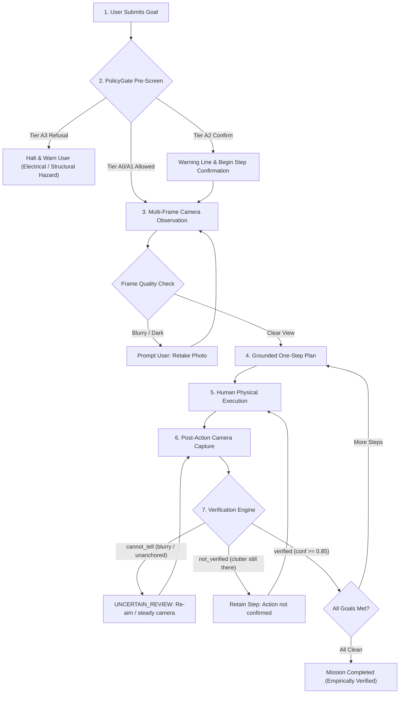

# MIRROR: Multimodal Interactive Reality Reasoning & Observation Routine

[]()
[]()

> **The One Rule of MIRROR:**  
> **MIRROR must never claim success without verification.** A physical action is verified *only* when fresh sensor observations confirm the required state change with heuristic confidence $\ge 0.85$. If sensor frames are blurry, dark, occluded, or ungrounded, the system halts with `cannot_tell` rather than hallucinating success.

---

## 1. What is MIRROR?

MIRROR is a safety-first, phone-grounded AI assistant designed to help people navigate unfamiliar physical environments—tidying a workspace, preparing a kitchen counter, inspecting a room, or setting up equipment.

Unlike conventional conversational AI assistants that output multi-step instructions blindly, MIRROR operates in a **strictly verified, closed physical loop**:
1. It ingests a natural-language goal and filters it through a deterministic **Policy Gate** (`PolicyGate`).
2. It captures real-world camera frames and identifies visible physical objects and anchors.
3. It generates **exactly one grounded step at a time**.
4. The user performs the action.
5. The camera captures fresh post-action frames.
6. The **Verification Engine** compares before and after evidence. A step passes *only* if required evidence is visibly present with confidence $\ge 0.85$.
7. The loop repeats until the backend confirms the space is fully prepared (`completed`).

---

## 2. The 7-Stage Verification Loop



---

## 3. Safety Architecture & Policy Tiers

MIRROR governs physical safety through a deterministic, regex-based policy gate (`src/core/policy.py`) before any model call or physical action is planned:

| Tier | Name | Behavioral Constraint | Example Tasks |
|---|---|---|---|
| **A0** | Pure Information | Autonomous advice; no physical state modification. | "How much light is in this room?" |
| **A1** | Reversible Physical | Simple reversible tidying; low kinetic risk. | "Move coffee cup off desk", "Tidy notebooks" |
| **A2** | Human Confirmation | Moderate hazard; warning line plus explicit Begin step confirmation. | "Move knife into block before food prep" |
| **A3** | Default Deny (Refusal) | Hard refusal; never guided; directs to professional. | "Fix loose wall socket wiring", "Chemical handling" |

---

## 4. Running the Project

Refer to [`docs/architecture/RUNNING.md`](docs/architecture/RUNNING.md) for full setup instructions.

### Prerequisites
- Python 3.11+ (tested on Python 3.13)
- Android Studio / JDK 17 (for mobile app build)

### A. Python Backend & Test Suite

1. **Activate Virtual Environment & Install Dependencies:**
   ```bash
   # Windows PowerShell:
   .\.venv\Scripts\Activate.ps1
   pip install -e ".[dev]"
   ```

2. **Run Pytest Suite (268 Backend Tests):**
   ```bash
   python -m pytest
   ```
   *Verifies policy gate rules, loop state transitions, false success prevention, low-confidence rejection, session logging, and API contracts.*

3. **Start the FastAPI Backend:**
   ```bash
   # Local only:
   python -m uvicorn src.api.main:app --host 127.0.0.1 --port 8000 --reload
   # Accessible from mobile phone on the same Wi-Fi network:
   python -m uvicorn src.api.main:app --host 0.0.0.0 --port 8000
   ```
   *Endpoints: `GET /v1/health`, `POST /v1/sessions`, `POST /v1/sessions/{id}/observe`, `POST /v1/sessions/{id}/plan`, `POST /v1/sessions/{id}/verify`.*

### B. Standalone Web & UI Preview

To inspect the user interface and screen flow in any browser without Android Studio (mock preview, does not call the backend):
```bash
python -m http.server 8080
```
Open `http://localhost:8080/src/ui/web_preview/index.html` or `http://localhost:8080/public/index.html`.

### C. Android App Build

The Android client is built with Kotlin 2.0 and Jetpack Compose (`app/` module):
```bash
# In project root:
./gradlew :app:assembleDebug
./gradlew :app:testDebugUnitTest
```

#### Windows Development Note:
If you encounter `java.io.IOException: Unable to establish loopback connection` during Gradle runs on Windows (due to short paths or spaces in `C:\Users\...`), set a clean temp directory:
```bash
mkdir C:\mirror-tmp
$env:JAVA_TOOL_OPTIONS="-Djdk.net.unixdomain.tmpdir=C:/mirror-tmp"
.\gradlew :app:testDebugUnitTest --no-daemon
```

---

## 5. Honest Validation Status & Known Limitations

Per the project integrity rules in `AGENTS.md` and [`docs/architecture/VALIDATION.md`](docs/architecture/VALIDATION.md), nothing is estimated or exaggerated:

### Verified Facts
- **268 backend tests pass, 0 skipped** (`python -m pytest`), verifying the policy gate, loop invariants, schema compliance, false success prevention, session logging, and production hardening.
- **27 Android unit tests pass** (`./gradlew :app:testDebugUnitTest`, Gradle 8.9, AGP 8.5.2, Kotlin 2.0.20, JDK 17), covering controller state machine transitions, photo-consent rules, JSON parsing, API key header, and frame metrics.
- **Android debug build succeeds**: `./gradlew :app:assembleDebug` produces APKs in git-ignored `dist/`.
- **Full HTTP loop verified**: Tested over real HTTP using `uvicorn` and a scripted client (refusal on electrical hazard, `needs_observation` before capture, `not_verified` on missing evidence, `cannot_tell` on blur, and `completed` after verified action).
- **Independent CI on GitHub Actions**: Both Android CI (JDK 17, SDK 34, `:app:testDebugUnitTest`, `:app:assembleDebug`) and MIRROR CI (`pytest`) pass green on clean Linux runners.

### Explicit Limitations (Marked UNVERIFIED)
- **Nothing has run on a phone or emulator:** CameraX capture, permissions, and the app's HTTP client against a live server are unexercised on physical silicon.
- **Never run on a device:** The live camera preview, the camera-permission flow, and the photo-consent dialog have unit-tested logic, but the physical screens have not run on a device.
- **No real model has been called:** The backend defaults to `FakeModelClient`. `AnthropicModelClient` is tested only with a mocked transport. No API key exists in this repo. The fake provider cannot read real photos, so the phone app cannot get past "scan again" until a provider key is set.
- **Thresholds are heuristic:** Blur limit (0.60), brightness minimum (0.20), the confidence formula, and the 0.85 bar are heuristics, not calibrated against empirical data.
- **Planner is a rule template:** The planner uses deterministic templates for study, work, and cook spaces; it is not a generative AI planner.

---

## 6. Multi-Seat AI Development Model

MIRROR is developed through a structured multi-agent pair programming model with strictly segregated seats and lanes (`AGENTS.md`):

| Seat | Role | Lane / Deliverables |
|---|---|---|
| `claude` | Lead Engineer | Architecture, core logic, safety policy, PR code reviews. |
| `ag-a` | Frontend & UI | Jetpack Compose screens, UI flow, web preview, decoupling. |
| `ag-b` | QA & Reliability | Test suites, CI workflows (`android.yml`, `ci.yml`), E2E HTTP loop tests. |
| `ag-c` | Reserve Support | SQLite session audit log writer (`src/core/session_log.py`). |
| `studio-a` | Research & Datasets | Literature review, benchmark scenes (`data/scenes.json`), perception prompts. |
| `studio-b` | Docs & Presentation | `README.md`, report outline, demo script, presentation deck. |
| `copilot` | Standalone Tools | Interactive CLI demo client (`tools/demo_client.py`). |

---

## 7. Repository Structure

```
├── .github/workflows/     # CI automation (android.yml, ci.yml)
├── contracts/             # JSON schemas for sessions, observations, plans, verifications
├── data/                  # Standardized physical verification benchmark (12 sample scenes)
│   ├── scenes.json        # Machine-readable benchmark scenes (all marked sample)
│   └── scenes.md          # Human-readable benchmark documentation and taxonomy
├── db/                    # SQLite database schema (schema.sql)
├── docs/                  # Architecture, decisions, tasks, status, and reports
│   ├── architecture/      # System design, verification engine, safety policy, validation notes
│   ├── report/            # Academic report outline and 3-minute demo script
│   ├── slides/            # 8-slide presentation deck outline
│   └── status/            # Individual status handoff files for each seat
├── prompts/               # VLM perception prompt specifications
├── research/              # Literature citations (sources.md) and empirical plan (PLAN.md)
├── src/
│   ├── api/               # FastAPI HTTP routing (/v1/sessions), production security
│   ├── core/              # Engine, PolicyGate, Verifier, ModelClient, Planner, SessionLog
│   ├── mobile/            # Android CameraX, HttpURLConnection, and controller implementation
│   └── ui/                # Jetpack Compose UI screens, components, theme, web preview
└── tools/                 # Standalone demo client and secure server runner
```

---

## 8. License & Attribution

Repository owned by Ram Nivas (`ramnivasattanti2008@gmail.com`). License to be determined by owner. Developed with multi-agent AI pair programming assistance. All AI contributions and benchmark samples are disclosed honestly.
